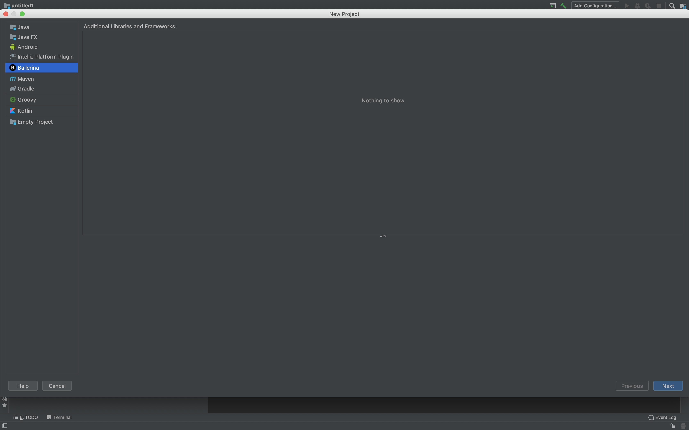

# Setting up Ballerina SDK

After [installing the IntelliJ Ballerina plugin](intellij-plugin-doc.md), you need to set up Ballerina SDK for your Ballerina projects to activate all the capabilities of the plugin. 

Click on the below links for instructions on how to set up Ballerina SDK.

- [Setting up for a new project](#setting-up-for-a-new-project)
- [Setting up for an existing project](#setting-up-for-an-existing-project)

## Setting up for a new project

Follow the steps below to set up Ballerina SDK when creating a new Ballerina project.

1. In the editor, click **File** in the top menu, click **New**, and then click **Project**. 

2. Click **Ballerina** and then click **Next**.

3. If you do not have an already-configured Ballerina SDK, click **Configure** to add a new Ballerina SDK.

>**Tip:** If you have already-configured Ballerina SDKs, you can select one of them and click **Next** to continue with the project creation.

4. Select the location of the Ballerina distribution and click **Open**.

Now, you have successfully added the Ballerina SDK. Click **Next** and continue with the project creation.

## Setting up for an existing project

Follow the steps below to set up Ballerina SDK for an exisitng Ballerina project.

1. Open the Project to which you want to set up a Ballerina SDK.

2. In the editor, click **File** in the top menu, click **Project Structure**.

3. If you do not have an already-configured Ballerina SDK, in the **Project** tab, click **New** under **Project SDK:**, click **Ballerina SDK**, and then click **OK**. 

>**Tip:** If you have already-configured Ballerina SDKs, select one under **Project SDK:** and click **OK** to continue.

4. Select the location of the Ballerina distribution and click **Open**.

5. Click **Apply** to save the changes.

>**Tip** This prompts a restart request. Click **Restart** to apply the changes.

Now, you have successfully added the Ballerina SDK to this project.
