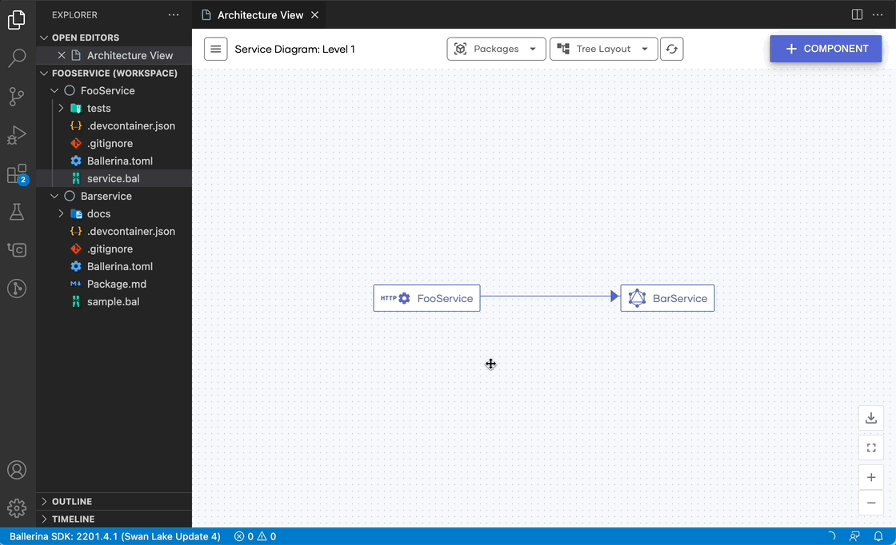

# Design using the Architecture View

The Architecture View includes various editing capabilities that make it possible to design applications. The sections below explore these capabilities by executing the **Architecture View** command on an empty workspace.

## Add components

Use the **Add Component** option of the Architecture View to add the first component of your project as shown below. 

!!! Info
    If your project has components, you can use the **Add Component** option on the top left corner of the diagram to do the same.

## Delete components

If a component of your application is not dependent on another, you can delete it using the **Delete Component** option available on the node menu (displayed when hovering on a node). This option will provide two choices to you, either to delete only the particular service or the entire Ballerina package.

## Link to an internal API

You can create links between your project components using the **Use Internal API** option in the node menu. That will introduce a service-level client in your source service, which you can configure and use.

## Link to an external API

You can invoke an external endpoint using the **Use External API** option in the node menu. That will prompt you to a connector marketplace from which you can choose the required external endpoint.

## Delete links

By hovering over a link, you can choose to remove the particular interaction in your diagram. That will result in the deletion of the client that was used to interact between the services.

## Edit diagram labels

You can edit the display names of your project components using the **Edit Label** option in the node menu. That will update the **label** value of the particular component’s display annotation.

