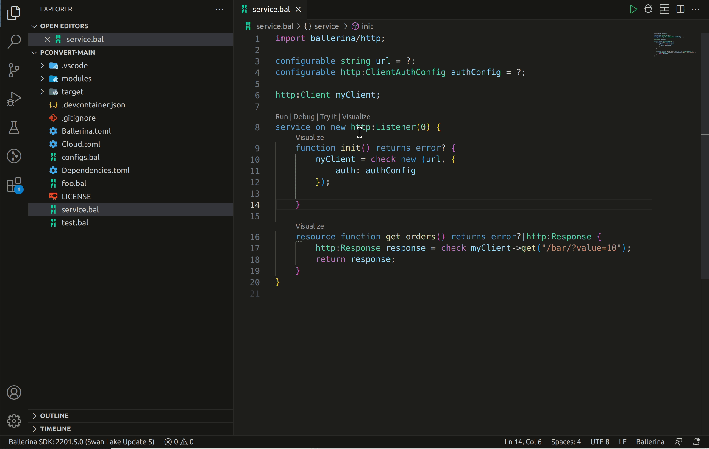
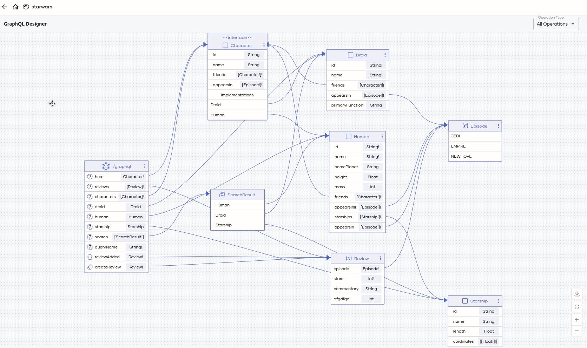

# Ballerina VS Code extension version 4.3.0

We are happy to announce the Ballerina VS Code extension 4.3.0 release with a few exciting new features and improvements. Following are the highlights of this release.

- [Entity Relationship Diagram](#entity-relationship-diagram) - Helps you visualize the ER diagram for your persist model file.
- [TOML config generator](#toml-config-generator) - Facilitates automatically generating the `Config.toml` file of your Ballerina project.

If you are new to Ballerina, you can download the [installers](https://ballerina.io/downloads/) to install it. You can install the Ballerina VS Code extension from the [VS Code marketplace](https://marketplace.visualstudio.com/items?itemName=WSO2.ballerina).

## New features

Below are the new features introduced by this release.

## Entity Relationship Diagram

With the latest Ballerina VS Code extension release (version 4.3.0) and <a href="https://ballerina.io/downloads/" target="_blank">Ballerina Swan lake Update 6 release</a>, now, you can generate the entity relationship diagram for your Ballerina persist model. This feature can be accessed using the icon available on the top-right corner of the editor panel or using the `Ballerina: Entity Relationship Diagram` command available in the VS Code command palette.

{.cInlineImage-full}

## TOML config generator

You can now automatically generate the `Config.toml` file for your Ballerina project. If there are mandatory configurable variables when you run the program via VS Code, it will prompt asking if you would like to create the `Config.toml` file. If you select **Create Config.toml**, it will create the `Config.toml` file in the package root. If a `Config.toml` file is already available, it will update it with new configurable fields. 

!!! Tip
    The `Config.toml` file will be added to the `.gitignore` file to prevent keys from getting committed to the GitHub repository.

{.cInlineImage-full}

## Improvements

Below are the improvements included in this release.

### GraphQL service designer

A new option is added to the GraphQL service designer to filter between queries, mutations, and subscriptions.

{.cInlineImage-full}
