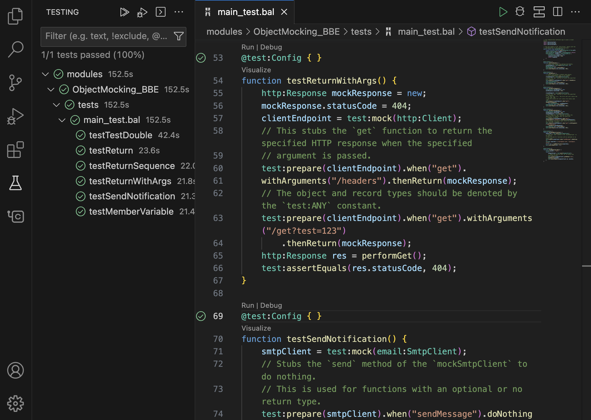

# Test the code

Tests are written in Ballerina programs by annotating them with `@test:Config: { }`. The Ballerina VS Code extension provides the ability to run the tests you have written in your Ballerina programs.

Click the **Run** CodeLens, which appears when you hover over the `@test:Config: { }` annotation to execute the tests. Also, click the **Debug** CodeLens to add breakpoints and debug the tests.

{cInlineImage-full}

!!! Info 
    For more information on debugging tests, see [Test debug sessions](../debug-the-code/debug-sessions/#test-debug-sessions_1).
