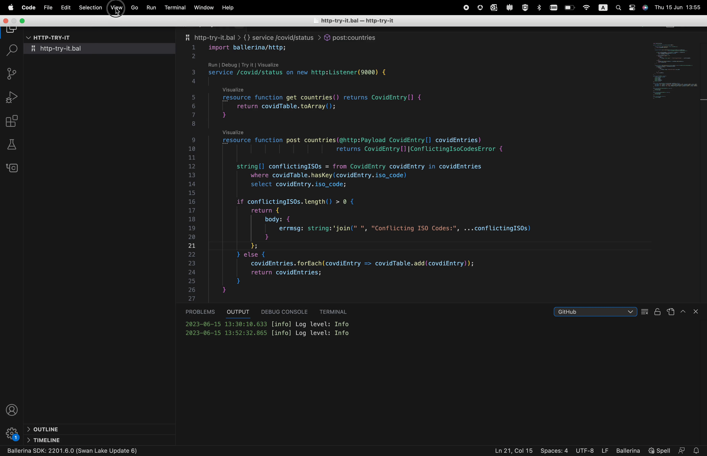
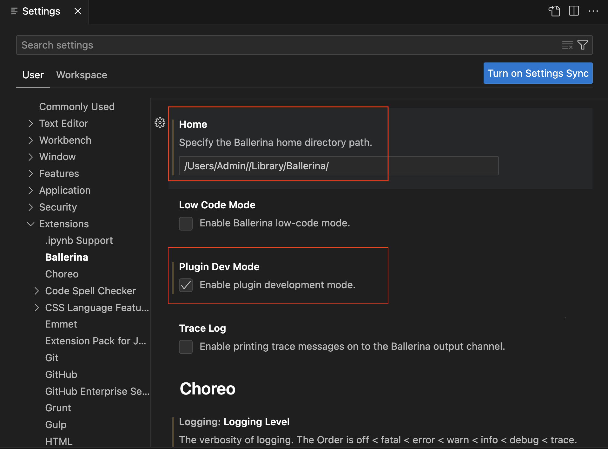
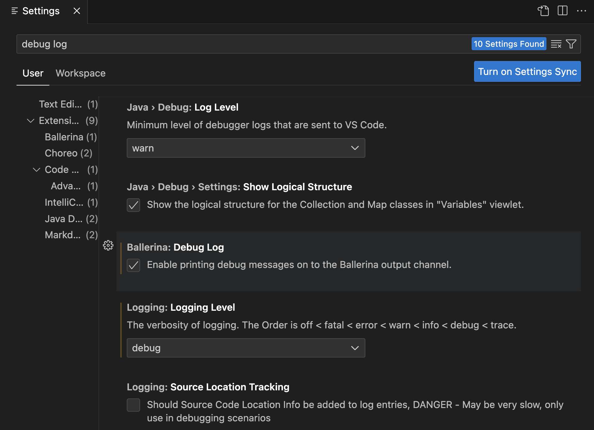

# Troubleshoot

You can troubleshoot the Ballerina VS Code extension as follows.

## View the Ballerina output

To view the Ballerina output tab, click **View**, click **Output**, and select **Ballerina** from the output list. It displays the details of the current Ballerina distribution and provides additional information if the plugin fails to detect a Ballerina distribution.

{cInlineImage-full}

## Set up a custom Ballerina path

Follow the steps below to change the currently active Ballerina distribution and add a custom Ballerina path.

1. Download the Ballerina distribution version you want to use and save it in a preferred location.

2. Click the **Manage** icon in the left-hand-side menu of the VS Code editor.

3. Click **Extensions** and **Ballerina** in the left-hand-side menu of the **Settings** window.

4. Enter the path of the custom Ballerina distribution, which you downloaded and saved.

5. Select **Enable plugin development mode**.

{cInlineImage-full}

## Enable debug logs

You can also enable the [debug logs](https://wso2.com/ballerina/vscode/docs/configure-the-extension/#advanced-configurations) from the Ballerina extension settings to view any issues arising from the extension features.

{cInlineImage-full}
