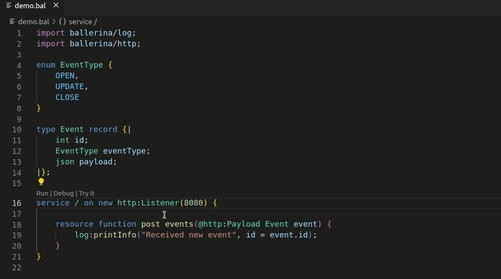
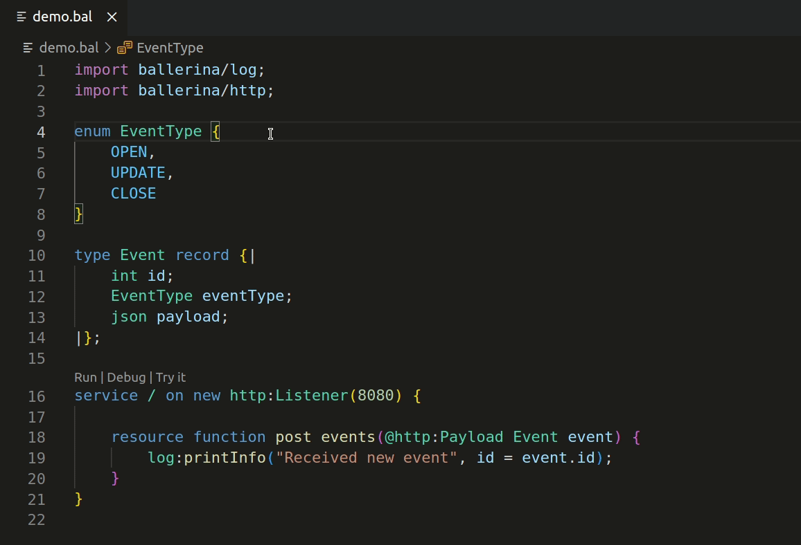
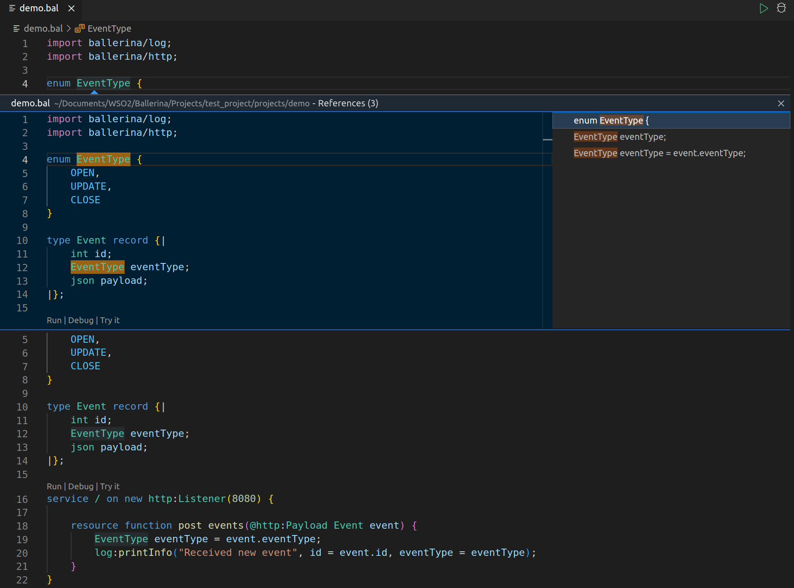
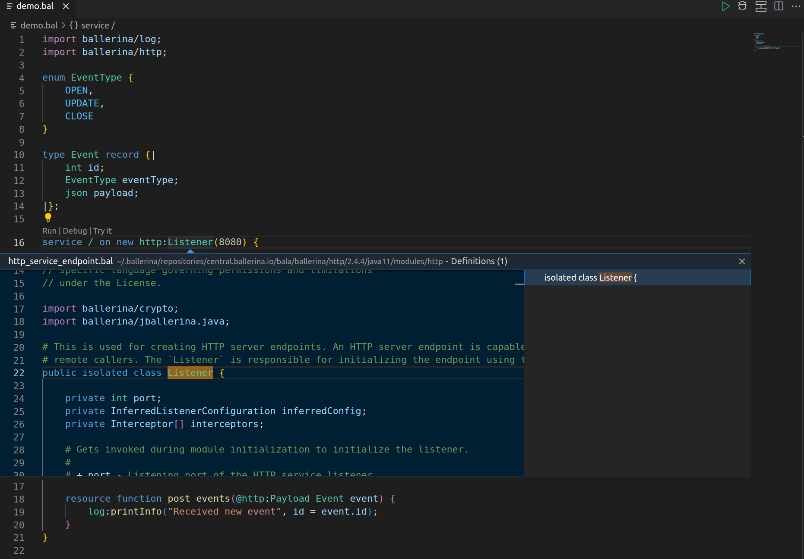
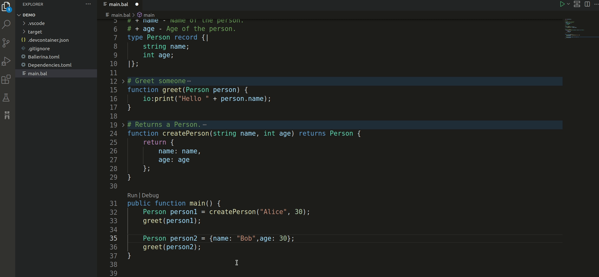

# Code navigation

The Ballerina VSCode extension provides support for [code navigation](https://code.visualstudio.com/docs/editor/editingevolved). Different kinds of supported navigations are described in the following sections.

## Go to definition

The [Go to definition](https://code.visualstudio.com/docs/editor/editingevolved#_go-to-definition) feature navigates you to the definition of a particular symbol. For example, when you invoke the `Go To Definition` option on a function call expression, it navigates you to the definition of the function.

{.cInlineImage-full}

## Go to symbol

The [Go to symbol](https://code.visualstudio.com/docs/editor/editingevolved#_go-to-symbol) feature allows you to navigate symbols inside a file.

{.cInlineImage-full}

## Find all references

Invoking the references (right click on a symbol and select **Find All References**) on a symbol will prompt you with all the symbol references in the current project.

{.cInlineImage-full}

## Peek

This feature allows you to [peek](https://code.visualstudio.com/docs/editor/editingevolved#_peek) the definition or references of a given symbol.

{.cInlineImage-full}

## Rename symbols

This feature allows you to rename symbols by renaming all the references of the particular symbol.

{.cInlineImage-full}
