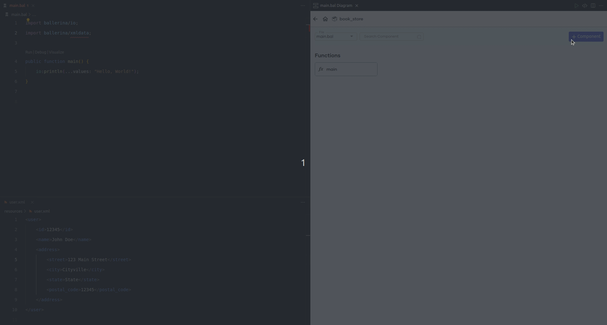
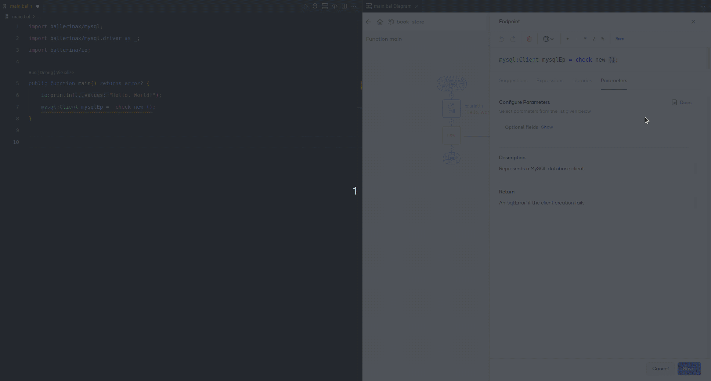
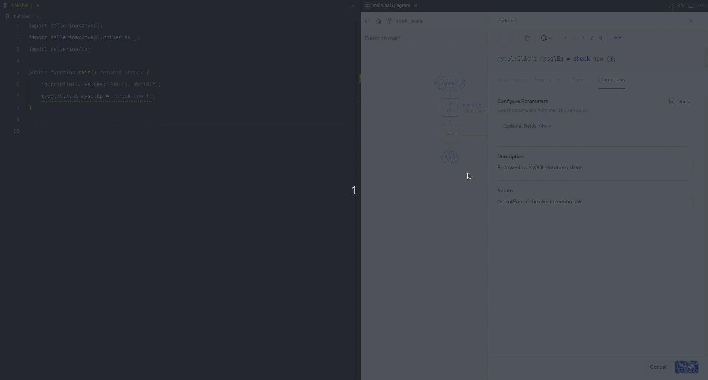
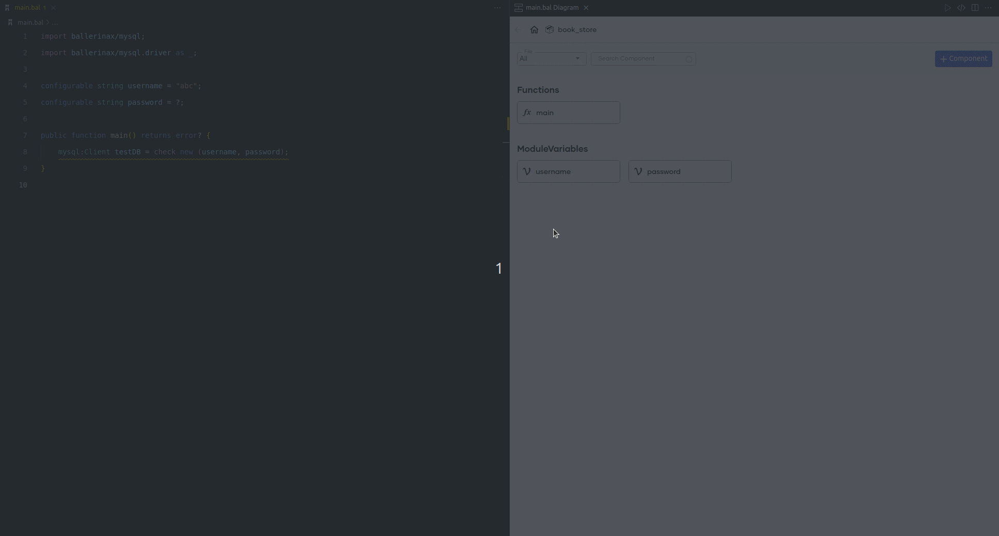

# Ballerina VS Code Extension Version 4.5.0

Hello, Ballerina community,

We're excited to present the Ballerina VS Code extension version 4.5.0! Here's what's new:

### What's Added

- **XML Import Option:** Now you can effortlessly create records by importing XML data. Building with XML in Ballerina is more convenient than ever.

    {.cInlineImage-full}

### What's Improved

- **Ballerina Documentation Link:** Easily access the Ballerina documentation when you select a function in the statement editor. Seamlessly switch between your code and the documentation.

    {.cInlineImage-full}

- **Better Parameter Configuration:** We've made the parameter configuration pane larger for smoother use. Configure function parameters with ease.

    {.cInlineImage-full}

- **Edit Top-Level Constructs:** Edit top-level constructs right from the statement editor. Simplified editing of complex statements in your Ballerina code.

    {.cInlineImage-full}

Thank you for your support! To get the latest version, visit the [VS Code marketplace](https://marketplace.visualstudio.com/items?itemName=WSO2.ballerina).

For more details, check out [Ballerina website](https://ballerina.io) 
