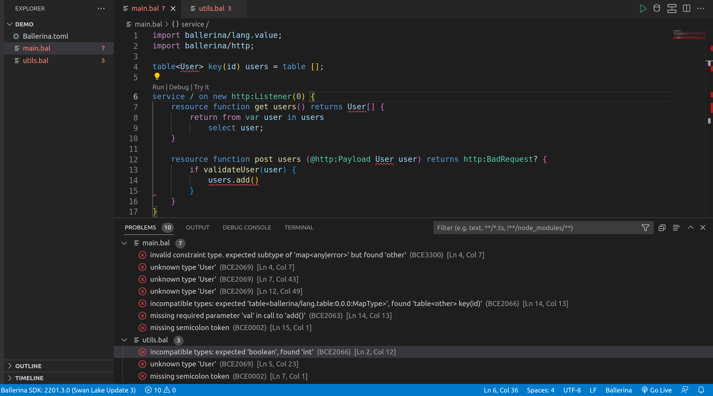
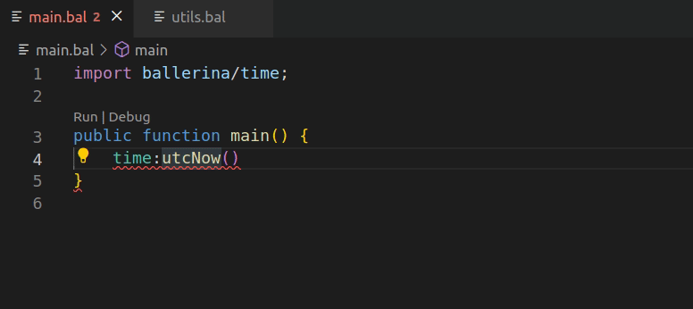

# Diagnostics

Diagnostics are the syntax and semantic errors that are identified in the source code. These may include a variety of errors and warnings. 

## View diagnostics

Diagnostics will show up in multiple places:

* There is a summary of all errors and warning counts displayed in the **Status Bar**.
* The **Summary** view and the **PROBLEMS** panel lists all of the current errors.
* Errors or warnings in a Ballerina file will be rendered in line with the text and in the **Overview** ruler.

{.cInlineImage-full}

## Perform quick fixes

For certain diagnostics, the possible quick fixes are suggested as code actions. You can easily select and apply the required quick fix from the list. 

For example, the `variable assignment is required` diagnostic suggests two quick fixes as follows: 
- Create a new variable
- Ignore the return value

{.cInlineImage-threeQuarter}
