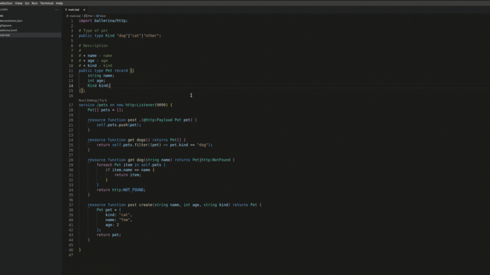

# IntelliSense

The sections below describe the IntelliSense features that can be used to edit Ballerina code via the VS Code extension.

## Code completion and snippets
The extension provides suggestions on variables, keywords, and code snippets of language constructs (such as functions, type definitions, services, iterable constructs, etc.).

{.cInlineImage-full}

Following are some key features of the code completion support provided by the extension.

### Context-aware completion items
The completion items list is sorted based on the context of the current cursor position.

{.cInlineImage-full}

### Suggestions for service templates
Service templates corresponding to each available listener are provided in the list of completion items.

{.cInlineImage-full}

### Completion support for iterables
The `foreach` and `foreach i` completion items are provided for iterable variables.

{.cInlineImage-full}

### Completion support for type guarding a variable
The `typeguard` completion item is provided for union-typed variables.

{.cInlineImage-full}

### Filling required fields of a record
The `Fill Record required fields` completion item is provided for filling the remaining fields of a `Record`-typed value.

{.cInlineImage-full}

## Help via hover
When hovering over a symbol name, you will be provided with quick information about the particular symbol. For example, when hovering over a function name, you will be prompted with the associated documentation.

{.cInlineImage-full}

## Signature help
When typing a function/method call expression, the signature help will show information such as the function/method call’s description and parameter information. Signature help will be triggered when typing the open parenthesis and comma.

{.cInlineImage-full}
