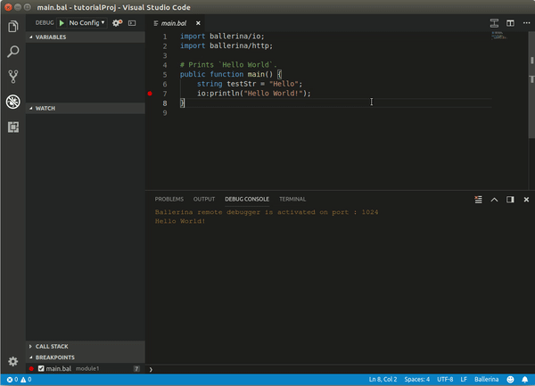

# Run all tests

This option allows you to run all the tests that belong to multiple modules of your project. Follow the steps below to do this.

1. Click **View** in the top menu and click **Command Palette**.
2. In the search box, type "Ballerina" and click **Ballerina: Run All Tests**.

## What's next?

- For information on the next capability of the VS Code Ballerina plugin, see [Graphical Editor](graphical-editor.md).
- For information on the VS Code Ballerina plugin, see [The Visual Studio Code Plugin](../vscode-plugin.md).
- For information on the tools and IDEs that are supported by the VS Code Ballerina plugin, see [Tools and IDEs](../../tools-ides.md).
